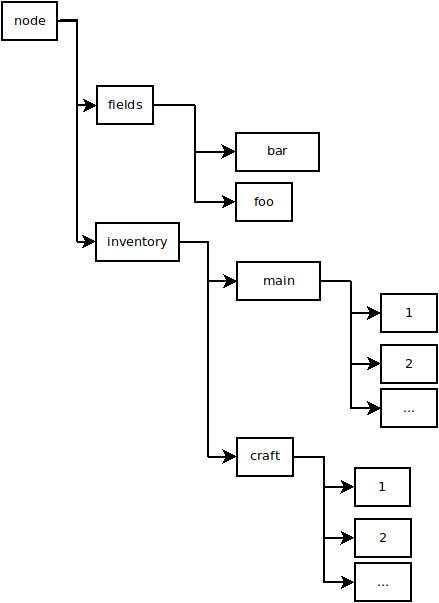

# Minetest mod metatools

Get everything possible* about a node just by clicking it with metatools:stick!

This goes far beyond Lymkwi's metatools.


## Differences in Poikilos' fork
- All known* metadata is shown on click! There is no need for various commands to traverse the tree, though the original chat command code is intact.
- Click a node and get its inventory.
- Click an entity and list the entire LuaEntitySOA tree!
  - See the "[Minetest API Notes](minetest-api-notes)" section below.
- The texture is redone so that doesn't any longer have an invasive and inappropriate CC-BY-NC-SA license from the upstream version of metatools.

`*` All metadata where how to obtain it is known by the maintainer of this repo (except where there is an open issue).


## Authors
Code:
- 2015-2016 LeMagnesium/Mg/ElectronLibre and Paly2/Palige (mod inspired by mgl512's itemframe issue)
- 2017-2022 Poikilos (Poikilos' fork of Version 1.2.2)

Textures:
- 2022 Poikilos (redone "metatools_stick.png" *replaces one with invasive and inappropriate CC-BY-NC-SA license [old texture was by Ataron]*)


## Purpose
This mod's aim is to provide a way for admins to navigate through any (ok, not
ignores) nodes on the map, and see values of its metadatas at any of their
stratum.


## Install
- You can remove the project folder to lighten the "game" if necessary (Keeping the png is useful but only for documentation--Nothing in "projects" is used by the mod code).


## Special thanks
- mgl512 (Le_Docteur) for its locked itemframe which gave me the idea of a tool
  allowing to see/edit metadatas
- Ataron who created the stick's texture
- palige who agreed to test the mod for its first release, and contributed to the last version


## Command tutorial
- Soon to come, please refer to /meta help until then


## Development

### Minetest API Notes

#### Entity Metadata
The magic sauce to get the entire LuaEntitySOA of a pointed_thing was finally discovered by accident (when researching unrelated API feature(s)) after no one would/could answer my question:
```Lua
local pointedObjRef = pointed_thing.ref;
-- . . . some other code is here, then ...
local luaEntity = pointedObjRef:get_luaentity();
```

#### Node metadata


```
Node
|
+-fields
| |
| +-foo
| +-bar
| +-...
+-inventory
  |
  +-main
  | |
  | +-1
  | +-2
  | +-3
  | +-...
  +-craft
  | |
  | +-1
  | +-2
  | +-3
  | +-...
    +-...
```
